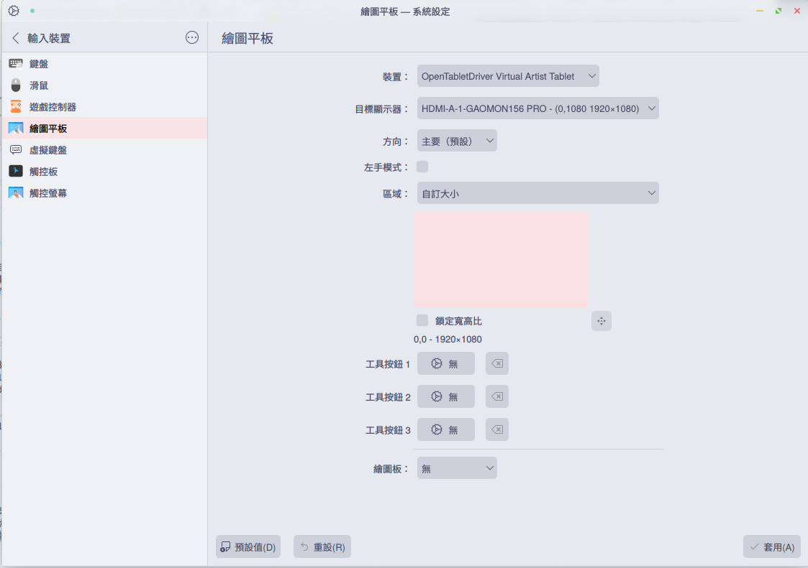
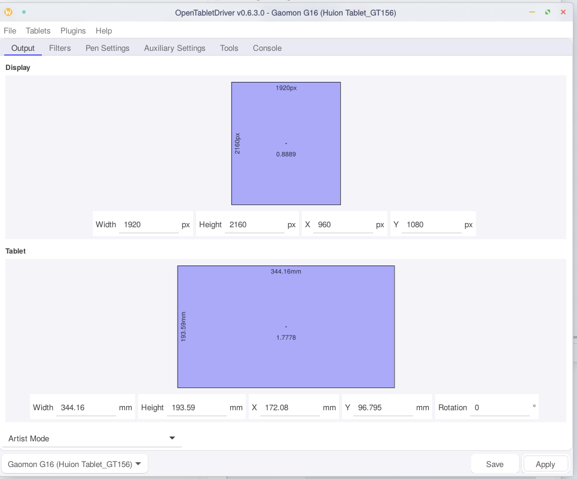

## 0x0 前言

最近給自己升級了畫畫的配件，買了個繪圖屏<del>畫畫沒進步，裝備倒是不斷在升級</del>，看來看去選了高漫的G16，聽說性價比很好，看上去也能滿足我的需求，就下單了～
到手後開開心心地插上了電腦，發現只有屏亮了，筆是一點反應也沒有，看了眼 OpenTabletDriver 的日志，也沒檢測出板子來，估計是沒適配吧，高漫也不提供 Linux 驅動————有那麼一瞬間想換回 Windows 了。
不過想了想自己在 Linux 上配了那麼多服務，還有 2TB 的數據要遷移，還是算了，只能試圖給 OpenTabletDriver 加上適配了。

## 0x1 OpenTabletDriver 的 Configuration

[OpenTabletDriver](https://github.com/OpenTabletDriver/OpenTabletDriver)

OTD 的適配不算麻煩，只要改改幾個參數就好，當然前提是有能用的 Parser ，反正我直接抄了個別的高漫的就能用了，不幸中的大幸，不然我還要配一個 OTD 的編譯環境。
注意 G16 在升級固件前只有 8192 的壓感。
其中Width/Height是物理尺寸，單位是mm，MaxX/MaxY是板子的坐標，數值可以在驅動裡看(我還裝了個windows kvm裝了驅動給板子用呢)
VendorID/ProductID可以在lsusb裡看，DeviceStrings可以在OTD裡的DeviceString reader讀取
AuxiliaryButtons理應是13，不過ReportParser不支持那個轉盤，試了幾個都不支持，反正我也不用
Json在Linux下放到`~/.config/OpenTabletDriver/Configurations/`即可, Windows下放到和.exe同位置的`Configurations/`

```json
{
  "Name": "Gaomon G16 (Huion Tablet_GT156)",
  "Specifications": {
    "Digitizer": {
      "Width": 344.16,
      "Height": 193.59,
      "MaxX": 68840,
      "MaxY": 38720
    },
    "Pen": {
      "MaxPressure": 16383,
      "ButtonCount": 2
    },
    "AuxiliaryButtons": {
      "ButtonCount": 11
    },
    "MouseButtons": null,
    "Touch": null
  },
  "DigitizerIdentifiers": [
    {
      "VendorID": 9580,
      "ProductID": 109,
      "InputReportLength": 12,
      "OutputReportLength": null,
      "ReportParser": "OpenTabletDriver.Configurations.Parsers.Huion.GianoReportParser",
      "FeatureInitReport": null,
      "OutputInitReport": null,
      "DeviceStrings": {
        "201": "GM001_M20b_\\d{6}$"
      },
      "InitializationStrings": [
        200
      ]
    }
  ],
  "AuxiliaryDeviceIdentifiers": [],
  "Attributes": {
    "libinputoverride": "1"
  }
}
```

## 0x2 映射

到這一步基本上是能用的了，如果你不分屏也不需要擔心映射的問題，但既然多了個屏怎麼能不用上呢。
然後你就會發現，Artist和Absolute映射模式不一樣！（其實我只在KDE下測試過，也許Gnome不會，但誰會用Gnome呢）
這是因為KDE對Artist下的板子會再映射一次，需要在輸入裝置裡修改。

同時在OTD內不進行任何映射。

分屏的配置


## 0x3 總結

沒甚麼好總結的，反正能用了，就這樣吧。
如果有人願意做一個Parser支持那個轉盤就更好了，OTD的TabletDebugger裡可以看到Raw Tablet Data(瘋狂暗示)。
