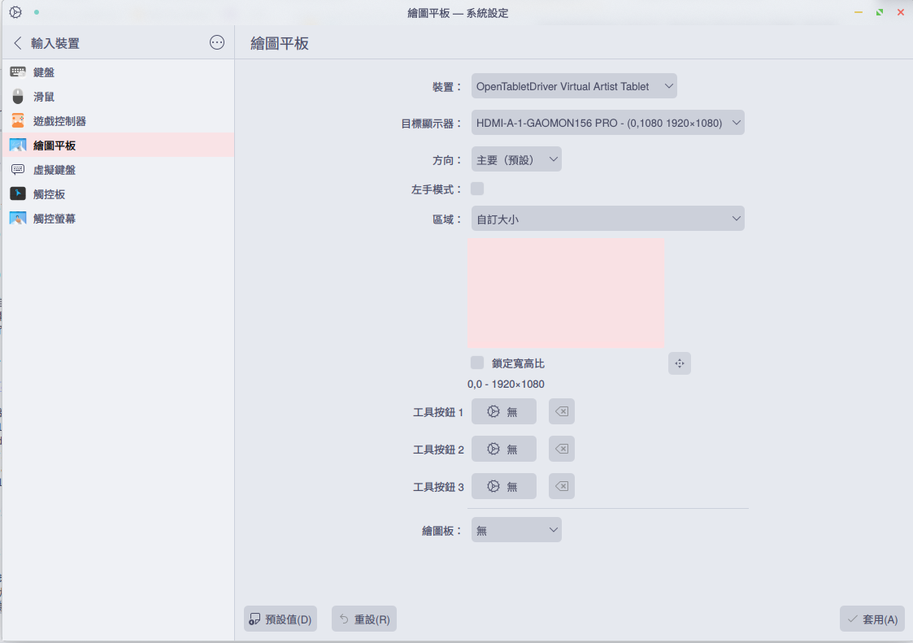
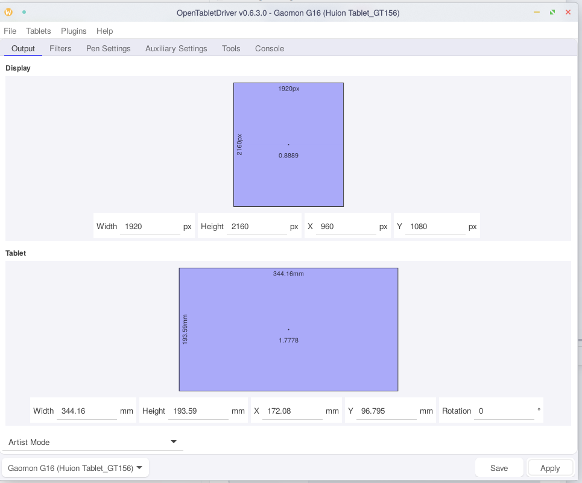
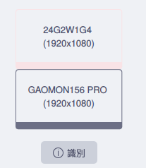

最近給自己升級了畫畫的配件，買了個繪圖屏<del>畫畫沒進步，裝備倒是不斷在升級</del>，看來看去選了高漫的 G16，聽說性價比很好，看上去也能滿足我的需求，就下單了～
到手後開開心心地插上了電腦，發現只有屏亮了，筆是一點反應也沒有，看了眼 OpenTabletDriver 的日志，也沒檢測出板子來，估計是沒適配吧，高漫也不提供 Linux 驅動————有那麼一瞬間想換回 Windows 了。
不過想了想自己在 Linux 上配了那麼多服務，還有 2TB 的數據要遷移，還是算了，只能試圖給 OpenTabletDriver 加上適配了。

<!-- more -->

## 0x1 OpenTabletDriver 的 Configuration

[OpenTabletDriver](https://github.com/OpenTabletDriver/OpenTabletDriver)

OTD 的適配不算麻煩，只要改改幾個參數就好，當然前提是有能用的 Parser ，反正我直接抄了個別的高漫的就能用了，不幸中的大幸，不然我還要配一個 OTD 的編譯環境。
注意 G16 在升級固件前只有 8192 的壓感。
其中 Width/Height 是物理尺寸，單位是 mm，MaxX/MaxY 是板子的坐標，數值可以在驅動裡看(我還裝了個 windows kvm 裝了驅動給板子用呢)
VendorID/ProductID 可以在 lsusb 裡看，DeviceStrings 可以在 OTD 裡的 DeviceString reader 讀取
AuxiliaryButtons 理應是 13，不過 ReportParser 不支持那個轉盤，試了幾個都不支持，反正我也不用
Json 在 Linux 下放到`~/.config/OpenTabletDriver/Configurations/`即可, Windows 下放到和.exe 同位置的`Configurations/`

```json
{
   "Name": "Gaomon G16 (Huion Tablet_GT156)",
   "Specifications": {
      "Digitizer": {
         "Width": 344.16,
         "Height": 193.59,
         "MaxX": 68840,
         "MaxY": 38720
      },
      "Pen": {
         "MaxPressure": 16383,
         "ButtonCount": 2
      },
      "AuxiliaryButtons": {
         "ButtonCount": 11
      },
      "MouseButtons": null,
      "Touch": null
   },
   "DigitizerIdentifiers": [
      {
         "VendorID": 9580,
         "ProductID": 109,
         "InputReportLength": 12,
         "OutputReportLength": null,
         "ReportParser": "OpenTabletDriver.Configurations.Parsers.Huion.GianoReportParser",
         "FeatureInitReport": null,
         "OutputInitReport": null,
         "DeviceStrings": {
            "201": "GM001_M20b_\\d{6}$"
         },
         "InitializationStrings": [200]
      }
   ],
   "AuxiliaryDeviceIdentifiers": [],
   "Attributes": {
      "libinputoverride": "1"
   }
}
```

## 0x2 映射

到這一步基本上是能用的了，如果你不分屏也不需要擔心映射的問題，但既然多了個屏怎麼能不用上呢。
然後你就會發現，Artist 和 Absolute 映射模式不一樣！（其實我只在 KDE Wayland 下測試過，也許 Gnome 不會，但誰會用 Gnome 呢）
這是因為 KDE Wayland 對 Artist 下的板子會再映射一次，需要在輸入裝置裡修改。
順帶一提 Absolute 是沒有壓感的，只能打 osu!

同時在 OTD 內不進行任何映射。

分屏的配置


## 0x3 SAI2

在 Linux 上用 SAI2 確實非常不方便，不過我還是找到了辦法。

[Bottle](https://github.com/bottlesdevs/Bottles) 可以在 Linux 上用 Wine 運行 Windows 程序，並且可以獨立安裝 Wine 環境，不會影響系統。
安裝教程建議看官方的，這裡就不贅述了。

Bottle 的配置如圖：


注意 wine 的版本，不能太新，當前最新的 8.21 會崩潰，建議是直接用 `kron4ek-wine-8.13-staging-tkg-amd64`，測試過這版本是沒太大問題的。

另一個重要的配置是 sai2 裡的

步驟記錄不能寫在磁盤上，我推測是 wine 或者 ntfs 的問題，總之只能關掉，否則會出錯，雖然也不影響實際畫畫。

## 0x4 總結

沒甚麼好總結的，反正能用了，就這樣吧。
如果有人願意做一個 Parser 支持那個轉盤就更好了，OTD 的 TabletDebugger 裡可以看到 Raw Tablet Data(瘋狂暗示)。
