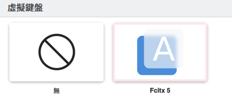

## 0x0 前言

Linux 下的配置相當混亂，其中一個最明顯的就是 Locale 和輸入法相關設置，由於我找不到一個完整的文檔，所以決定自己來整一個．這裡也會包含 fcitx5/rime 的設置,畢竟這玩意的配置也挺反人類的，官方文檔也不說人話。

## 0x1 注

解釋會導致文章過長，所以建議自己配合 Google 服用

注意環境變量是繼承/由調用者設置的，所以找不到的話可以往上找找

包含了被 deprecated 的設置，畢竟誰知道呢

雖然文檔說 LC_ALL 不好，但這可能是唯一一個所有程序都專重的設置，而且不會被擅自修改，只要變了那肯定是你手動設置的.

```bash
# 相關環境變量
LANG=
LANGUAGE=
LC_CTYPE=
LC_NUMERIC=
LC_TIME=
LC_COLLATE=
LC_MONETARY=
LC_MESSAGES=
LC_PAPER=
LC_NAME=
LC_ADDRESS=
LC_TELEPHONE=
LC_MEASUREMENT=
LC_IDENTIFICATION=
LC_ALL=
```

## 0x2 系統語言

`/etc/locale.gen`
`/etc/locale.conf`
`/etc/default/locale`
`/etc/profile`
`/etc/profile.d/`
`/etc/security/pam_env.conf`
`/etc/environment`
`/etc/env.d/*`
`/etc/systemd/system/user@.service.d/*`
`$HOME/.config/environment.d/*.conf`
`$HOME/.env`
`$HOME/.pam_environment`
`$HOME/.config/locale.conf`
`$XDG_CONFIG_HOME/locale.conf`

以及各種你自己的 shell 的 rc 檔，過多所以恕不全部列出
`$HOME/.profile`
`$HOME/.bash_profile`
`$HOME/.bash_login`
`$HOME/.bashrc`
`$HOME/.zlogin`
`$HOME/.zshrc`
`$HOME/.zshenv`
`/etc/bash.bashrc`
`/etc/zprofile`
`/etc/zsh/zprofile`
`$HOME/.zprofile`

## 0x3 圖形介面

`$HOME/.xinitrc`
`$HOME/.xsessionrc`
`$HOME/.xsession`
`$HOME/.config/environment.d/envvars.conf`
`$HOME/.config/plasma-workspace/env/*`
`$HOME/.config/plasma-locale/env/*`
`$HOME/.config/plasma-localerc`
`$HOME/.config/user-dirs.locale`
`$HOME/.gnomerc`
`/usr/share/xsessions/*`
`$HOME/.dmrc`
`$XDG_CONFIG_HOME/autostart/`
`$HOME/.config/autostart/`
`$XDG_CONFIG_DIRS/autostart/`
`/etc/xdg/autostart/`
`/usr/local/etc/xprofile`
`/etc/xprofile`
`$HOME/.xprofile`

## 0x4 其它軟件

- .desktop 等啟動程序可能會包含 LANG 等變量
- kitty 會自行重置 LANG 等變量
- KDE 會自行重置`$HOME/.config/plasma-localerc`

## 0x5 fcitx5/rime

- 如果遇到奇怪的問題，可以看看 fcitx5-qt fcitx5-gtk 有沒有裝
- 指令行部署 `rime_deployer --build ~/.local/share/fcitx5/rime/ /usr/share/rime-data ~/.local/share/fcitx5/rime/build`
- 輸入法設置[https://wiki.archlinux.org/title/Fcitx5\_(%E7%AE%80%E4%BD%93%E4%B8%AD%E6%96%87)](<https://wiki.archlinux.org/title/Fcitx5_(%E7%AE%80%E4%BD%93%E4%B8%AD%E6%96%87)>)

```bash
export GTK_IM_MODULE=fcitx
export QT_IM_MODULE=fcitx
export SDL_IM_MODULE=fcitx
export GLFW_IM_MODULE=ibus # fcitx5 ibus compaitible for kitty

export INPUT_METHOD=fcitx
export XMODIFIERS=@im=fcitx
```

## 0x6 fcitx5/rime wayland

在 KDE wayland 下要支持各種 electron 和 qt/gtk 軟件需要由 kwin 打開 fcitx 並配置 kcm

- 配置虛擬鍵盤
  －　

參考資料

- https://www.csslayer.info/wordpress/linux/use-plasma-5-24-to-type-in-alacritty-or-any-other-text-input-v3-client-with-fcitx-5-on-wayland/
- https://fcitx-im.org/wiki/Using_Fcitx_5_on_Wayland

## 0x7 後記和個人設置

個人用的是 KDE

我把所有 LANG 都塞 `$HOME/.xprofile` 裡了，用的是 `zh_TW.utf8`
`/etc/default/locale` 和 `/etc/locale.conf` 則是 `en_US.utf8`
輸入法也在 `.xprofile` 裡配置

## 0x8 changelog

- 2023-08-11 更新 kde wayland 下的 fcitx5 配置
