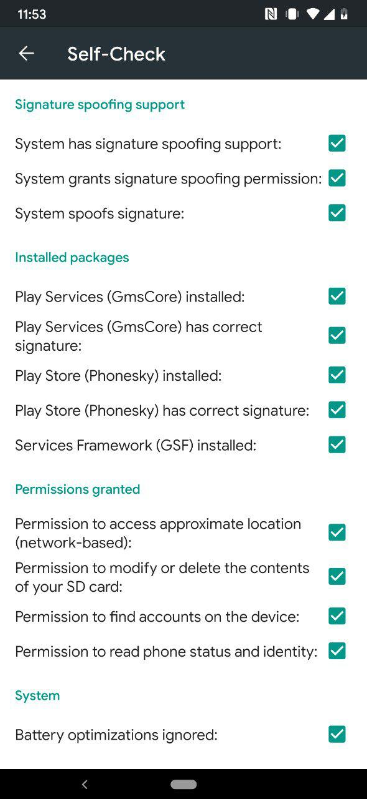

## 0x0 前言

_nanadroid 已不再更新，大概不建議繼續用，可以只看 microG 的部分_

眾所周知, 最近谷歌爆出的一件又一件的的隠私問題, Don’t be evil 仿佛成了一個笑話,
作為用戶嘛..最好的選擇當然是不用啦!
(瞄了眼手中的 Android, 嗯…)
好吧好吧, 至少我們可以代替掉一些谷歌的服務, 比如用 microG

## 0x1 開始之前?

你至少需要以下東西

1. 一部可以刷第三方 ROM 的 Android 手機 (當然
2. Magisk
3. 擇一安裝
   - NanoDroid
   - microG Installer Revived
     這裡就不教你裝 Magisk 了, 刷個 TWRP 刷個 magisk 就好, 谷歌一下吧 (嗯?)

btw, LOS 就不用看了, 看了也用不了, 自行谷歌教學吧 [LineageOS for microG](https://lineage.microg.org)

## 0x2 NanoDroid 的設置

[doc](https://gitlab.com/Nanolx/NanoDroid)

簡單整理和翻譯一下, 不特別描述的都是 1 為打開 0 為關閉

首先在 `/sdcard` `/data/media/0` 和 zip 的位置 創建一個叫 `.nanodroid-setup` 的配置檔案
填以下的配置, 然後刷 zip 就好了, 是不是很簡單ヽ(✿ ﾟ ▽ ﾟ)ノ

`nanodroid_play=[0|1|2|3][0|1]`
第一個數字:
0 = 啥都不裝
1 = Google Play
2 = Yalp Store // Google Play 代替品 1
3 = Aurora Store // Google Play 代替品 2, 比 Yalp 好看一點
第二個:
0 = 不裝 Fake Store
1 = Fake Store
`nanodroid_overlay=[0|1]`
看上去是刪除一些系統的東西, Systemless 的可以放心使用
`nanodroid_mapsv1=[0|1]`
啟用 microg v1 map api (我也不知道是啥)
`nanodroid_gsync=[0|1]`
谷歌同步
`nanodroid_swipe=[0|1]`
swipe(swype) 庫, 應該是某輸入法的庫, opengapps 裡也有, 但反正不知道有啥用
`nanodroid_forcesystem=[0|1]`
裝到系統裡 (指非 Systemless/Magisk)
`nanodroid_nlpbackend=[0|1][0|1][0|1][0|1]`
位置服務後端
0|1 = Déjà Vu location backend 逮蝦戶(誤)
0|1 = Ichnaea (Mozilla) location backend Mozilla 的
0|1 = Apple location backend 蘋果的
0|1 = Radiocells.org location backend 沒聽過

## 0x2.1 microG Installer Revived

沒甚麼配置可言
如果你需要 Google Play 的話需要下載[Phonesky](https://nanolx.org/fdroid/repo/Phonesky_132.apk)並放置到`/data/adb/Phonesky.apk`

## 0x3 安裝後的配置 (Google Play)

_先別急着打開 Google Play 登錄, 不然之後你還得重新登出登錄一遍_

打開 microG Settings, 裡面有個 Self-Check, 可以查看你離安裝成功還有多少東西要做

從上到下是

- 一般第三方 ROM 都支援, 不支援就…換一個系統吧
- 點一下就可以授權了
- 你可能需要到設定打開, 比如我的 Havoc 就在`設定 -> Havoc -> System -> System Spoof Signature
- 略略略
- Play Store (Phonesky) correct signature 如果這個沒有的話在終端或 adb 輸入 su -c pm grant com.android.vending android.permission.FAKE_PACKAGE_SIGNATURE

之後的設定就和 Google Play 無關了

然後回到上一頁, 把 Google device registration GCM, SafetyNet 打開就好
然後你就可以愉快地使用 Google Play 啦

## 0x4 Google Play 的代替品

[Aurora Store](https://auroraoss.com/)

能下載 Google Play 上的應用

[F-Droid](https://f-droid.org/en/)
嗯, F-Droid, FOSS (Free and open-source software) 應用市場, 不多說

## 0x5 一些 microG 不支援的東西

- Google Play Game
- Google Pay
- Swift Backup (v3.5.0+後能用但不能直接通過 microG 登錄)
- etc..
