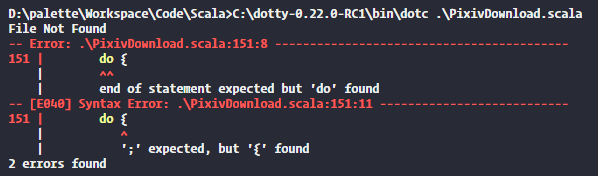
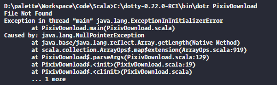

真實年更*(:3」∠)*
因為各種各樣的原因想試着日常用用 Scala 了，可是用作腳本的話編譯速度和啟動速度實在是太ー慢ー了，於是這裡就來試着調教一下讓 Scala 稍微能在日常用一點。

## 編譯

對於編譯其實沒有甚麼辦法，畢竟我菜。上網搜索了一會發現雖然有不少增量編譯等等，但似乎都是基於 sbt 等建構工具，一般都給大項目才能用，對腳本來說貌似意義不大。

## Dotty

再找找吧，發現 Scala 好像要出一個 Dotty 的編譯器，聽說編譯速度快了 20%？蚊子再小也是肉，趕緊下載一個來試試。
嗯，所以要怎麼用呢，dotc 在哪裡，好像沒有 dotc.bat,好像不支持 Windows 。繼續搜搜，找到了大佬翻譯的 Windows 版的 Link，不錯。

下載，編譯，崩潰，一氣呵成。


一看，原來 Dotty 改了不少格式，我都還沒開始學 Scala 2 就已經過氣了嗎。
改了改，總算過了編譯，運行，崩潰，哦吼。


這甚麼，初始化崩潰？NPE?這玩意初始化時都干了甚麼？仔細想了想，有差別的地方可能是因為直接繼承了 App 而不寫 main 了？改改，過了，可是為甚麼呢？

簡單推測一下，估計是 class 初始化時 args 還沒有被初始化，然後不知為甚麼(大概是 bug 吧)執行了本應該在 main 裡才執行的 parseArgs。然後就 NPE 了。

## 增量編譯 (?)

可是編譯還是好慢，不過雖然沒辦法繼續加快，但我可以減少編譯的次數嘛。於是，手寫了一個簡單的增量編譯，只在檔案有修改的時候才會重新編譯，雖然暫時只對單個檔案有效。

```powershell
param($file, $cp, $run)

$dest = "D:\TEMP"
$sourceDirectory = (Get-Item $file).DirectoryName
$className = (Get-Item $file).Basename
$destFile = $dest + $className + ".class"

$A = Test-Path -Path $destFile
if (-not $A -or ((Get-Item $destFile).LastWriteTime -lt (Get-Item $file).LastWriteTime)) {
   # # for scala fsc
   # fsc -d $dest $file
   # for dotty
   cmd /c "C:\dotty-0.22.0-RC1\bin\dotc" "-classpath" "`"$sourceDirectory;$($cp -join ";")`"" "-d" "`"$dest`"" "`"$file`""
   if(-not $?) {
      exit
   }
}

# faster startup (maybe)
$JVM_ARGS = @("-Xshare:on", "-XX:-TieredCompilation", "-XX:TieredStopAtLevel=1", "-client" )
$JVM_JARGS = @("-JXshare:on", "-JXX:-TieredCompilation", "-JXX:TieredStopAtLevel=1", "-Jclient" )
# # for scala
# java.exe @JVM_ARGS "-Dscala.usejavacp=true" "-cp" "C:\scala\lib\*" "scala.tools.nsc.MainGenericRunner" @JVM_JARGS "-cp" $dest $className @run

# for dotty
java.exe @JVM_ARGS -classpath "C:\DOTTY-~1.0-R\lib\dotty-library_0.22-0.22.0-RC1.jar;C:\DOTTY-~1.0-R\lib\scala-library-2.13.1.jar;$($cp -join ";");$dest" $className @run

# # for classloader server mode
# python D:\palette\Run\cl.py $dest $className @run
```

這玩意非常簡單，只是檢查了一下最後修改時間，不過管用就行嘛。

## 中段

其實 dotty 的啟動速度已經到了可以接受的範圍了，但，有沒有辦法更快呢？

## JVM

事實上我們可以先把 JVM 開着，動態加載 Class，甚至複用 Class 來減少 JVM 和 Class 的載入時間。Github 上已經有 NailGun 和 Drip 實現了，可惜一個跑不起來(也許是 JDK 版本太高)一個不支援 Windows，只好自己做了，幸好並不算難寫。

伺服器:

```java
import java.io.File;
import java.lang.reflect.InvocationTargetException;
import java.lang.reflect.Method;
import java.net.URL;
import java.net.URLClassLoader;
import java.security.Permission;
import java.util.ArrayList;
import java.util.Arrays;
import java.util.stream.Collectors;
import java.io.BufferedReader;
import java.io.IOException;
import java.io.InputStream;
import java.io.InputStreamReader;
import java.io.PrintStream;
import java.net.MalformedURLException;
import java.net.ServerSocket;
import java.net.Socket;

public class CLServer {
   private static final int PORT = 8080;
   static final PrintStream _out = System.out;
   static final PrintStream _err = System.err;
   static ClassLoader cl;
   static final boolean DEBUG = true;

   public static void debug(String message) {
      if (DEBUG) {
         _out.print("D> ");
         _out.println(message);
      }
   }

   public static void error(String message) {
      _out.print("E> ");
      _out.println(message);
   }

   public static void info(String message) {
      _out.print("I> ");
      _out.println(message);
   }

   public static void main(String[] args) throws NoSuchMethodException, SecurityException, IllegalAccessException,
         IllegalArgumentException, InvocationTargetException, IOException {
      System.setSecurityManager(new SecurityManager() {
         @Override
         public void checkExit(int status) {
            throw new RuntimeException("Blocking System.exit();");
         }

         @Override
         public void checkPermission(Permission p) {

         }
      });

      cl = URLClassLoader.newInstance(new URL[] {}, CLServer.class.getClassLoader());
      addURL(".");

      try (ServerSocket server = new ServerSocket(PORT)) {
         info("Server is listening " + PORT);

         while (true) {
            try {
               try {
                  Socket s = server.accept();
                  handleSocket(s);
               } catch (IOException e) {
                  System.setOut(_out);
                  System.setErr(_err);
                  e.printStackTrace();
               } finally {
                  System.setOut(_out);
                  System.setErr(_err);
               }
            } catch (Error | Exception e) {
               debug("continue anyway");
            }
         }
      }
   }

   public static void handleSocket(Socket s) throws IOException {
      InputStream is = s.getInputStream();
      PrintStream out = new PrintStream(s.getOutputStream());
      BufferedReader in = new BufferedReader(new InputStreamReader(is));

      System.setOut(out);
      System.setErr(out);
      try {
         handleCommand(in, out);
      } finally {
         out.flush();
         System.setOut(_out);
         System.setErr(_err);
         in.close();
         out.close();
         is.close();
         s.close();
      }
   }

   public static void handleCommand(BufferedReader in, PrintStream out) throws IOException {
      debug("Packet: ");
      String cmd = in.readLine();
      if (cmd.equals("#cp")) {
         debug("#cp");
         String data = in.readLine();
         debug(data);
         try {
            CLServer.addURL(data);
         } catch (Error | Exception e) {
            e.printStackTrace(out);
         }
      } else if (cmd.equals("#run")) {
         debug("#run");
         ArrayList<String> cps = new ArrayList<String>();
         String name = null;
         ArrayList<String> args = new ArrayList<String>();
         // 0 for cp, 1 for name, 2 for args
         int state = 0;
         String line;
         while ((line = in.readLine()) != null && line.length() > 0) {
            debug(line);
            if (line.equals("#cp")) {
               state = 0;
            } else if (line.equals("#name")) {
               state = 1;
            } else if (line.equals("#args")) {
               state = 2;
            } else {
               switch (state) {
               case 0:
                  cps.add(line);
                  break;
               case 1:
                  name = line;
                  break;
               case 2:
                  args.add(line);
               }
            }
         }
         if (name != null) {
            CLServer.callMain(addTempURL(cps.toArray(new String[] {})), name, args.toArray(new String[] {}), out);
         } else {
            out.println("E> Missing class name");
            error("Missing class name");
         }
      }
      debug("End Packet");
   }

   public static void addURL(String s) throws NoSuchMethodException, SecurityException, IllegalAccessException,
         IllegalArgumentException, InvocationTargetException, MalformedURLException {
      Method method = URLClassLoader.class.getDeclaredMethod("addURL", new Class[] { URL.class });

      File f = new File(s);

      method.setAccessible(true);
      info("Adding " + s);
      method.invoke(cl, new Object[] { f.toURI().toURL() });
   }

   public static ClassLoader addTempURL(String[] s) throws MalformedURLException {

      ClassLoader newCl = URLClassLoader.newInstance(Arrays.stream(s).map(x -> {
         try {
            info("Adding temp url " + x);
            return new File(x).toURI().toURL();
         } catch (MalformedURLException e) {
            throw new RuntimeException(e);
         }
      }).collect(Collectors.toList()).toArray(new URL[] {}), cl);
      return newCl;
   }

   public static void callMain(String className, String[] args, PrintStream out) {
      callMain(cl, className, args, out);
   }

   public static void callMain(ClassLoader cl, String className, String[] args, PrintStream out) {
      try {
         info("Running " + className);
         cl.loadClass(className).getMethod("main", String[].class).invoke(null, (Object) args);
      } catch (InvocationTargetException e) {
         e.getCause().printStackTrace(out);
      } catch (Error | Exception e) {
         e.printStackTrace(out);
      }
   }
}
```

客戶端:

```python
import socket
import select
import sys

host = "127.0.0.1"
port = 8080

def send(*data):
   s = socket.socket(socket.AF_INET, socket.SOCK_STREAM)
   s.connect((host,port))
   s.send(("\n".join(data) + "\n\n\n").encode())
   ready = select.select([s], [], [], 10)
   response = b""
   while True:
      if ready[0]:
         response = s.recv(1024)
      if not response:
         break
      print(response.decode(), end="")
   s.close ()

# # for scala
# send("#cp", "C:\\scala\\lib\\scala-compiler.jar")
# send("#cp", "C:\\scala\\lib\\scala-library.jar")
# send("#run",
#    "#name", "scala.tools.nsc.MainGenericRunner",
#    "#args", "-Jclient", "-cp", "C:\\scala\\lib\\scala-library.jar;"+sys.argv[1],
#    *sys.argv[2:]
# )

# for dotty
send("#run",
   "#cp", sys.argv[1],
   "C:\\DOTTY-~1.0-R\\lib\\scala-library-2.13.1.jar",
   "C:\\DOTTY-~1.0-R\\lib\\dotty-library_0.22-0.22.0-RC1.jar",
   "#name", sys.argv[2],
   "#args", *sys.argv[3:]
)
```

代碼非常簡單，自定義了一套協議，用來加入 cp 和執行 main 函數，和一些不太好看的黑科技。
可惜對 Dotty 的支持一般，不太清楚為甚麼但 Dotty 如果不每次加載的話輸出會消失，不過 Scala 沒這問題，而且 Dotty 的啟動其實也相當快，問題不大。

## 結語

代碼在 github 的 CodeColle/{Scala|Java}裡可以找到
目前還只支持單文件，以後有機會/需求可能會再繼續弄吧，一開始是因為 Python 太慢所以想找個新語言，也不知道被誰騙了居然選了 Scala，不過寫着寫着就發現 Scala 挺香的。

## changelog

1. 2020 Mar.5: 加入 dotty 的 classpath 支援, 其他的因為我不用所以懶得加了

2. 2020 Apr.13: 由於出現 OOM 了, 把 Xmx Xms 參數刪掉, 畢竟沒啥用
